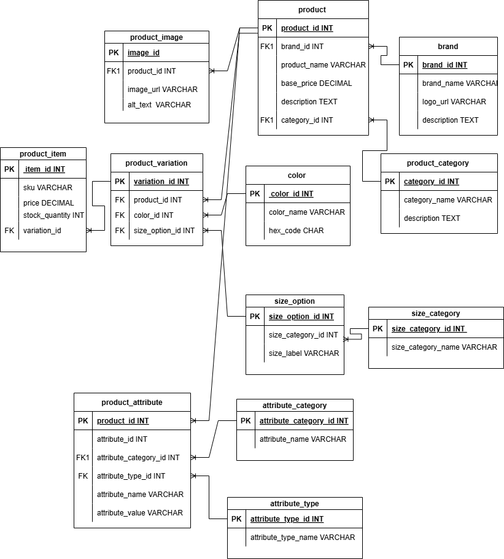

## GROUP 661 DATABASE PROJECT 


# E-Commerce Database Schema

This repository includes SQL scripts and schema definitions for an e-commerce platform database. It outlines tables, relationships, and data for brands, products, categories, colors, sizes, variations, images, and product attributes.

## Table of Contents

- [Project Overview](#project-overview)
- [Schema Structure](#schema-structure)
- [Prerequisites](#prerequisites)
- [Installation & Setup](#installation--setup)
- [Database Creation](#database-creation)
- [Seeding Data](#seeding-data)
- [Running the Scripts](#running-the-scripts)
- [Folder Structure](#folder-structure)
- [Contributing](#contributing)


---

## Project Overview

This project delivers a normalized MySQL database schema for an e-commerce application, featuring the following core entities:

- **Brand**: Stores manufacturer or brand details, including logos and descriptions.
- **Product Category**: Groups products into categories like Clothing or Electronics.
- **Product**: Defines individual items linked to a brand and category.
- **Product Image**: Stores multiple image URLs and alt text per product.
- **Color**: Lists named colors with standard hex codes for variations.
- **Size Category & Size Option**: Organizes size groupings and labels (e.g., S, M, L).
- **Product Variation**: Captures unique combinations of product, color, and size.
- **Product Item**: SKU-level entries with price overrides and stock levels.
- **Attribute Category & Attribute Type**: Defines custom metadata for product attributes.
- **Product Attribute**: Links specific attributes to products.


---

## Schema Structure

All tables utilize the InnoDB storage engine withfull Unicode compatibility. Foreign keys maintain referential integrity across:

- `brand` → `product`
- `product` → `product_category`
- `product_image` → `product`
- `product_variation` → (`product`, `color`, `size_option`)
- `product_item` → `product_variation`
- `product_attribute` → (`product`, `attribute_category`, `attribute_type`)

Refer to `schema.drawio` for full `CREATE TABLE` definitions with constraints.

---

## Prerequisites

- MySQL Server (v5.7 or later)
- MySQL Workbench (optional) or another client
- Git for cloning the repository

---

## Installation & Setup

1. **Clone the repository**

   ```bash
   git clone https://github.com/your-username/e-commerce-db.git
   cd e-commerce-db
   ```

2. **Configure database connection**

   Adjust your MySQL client or CLI credentials:

   ```bash
   mysql --user=root --password=yourpassword --host=localhost --port=3306 < schema.sql
   ```

---

## Database Creation

The `schema.sql` file includes:

1. `CREATE DATABASE  e_commerce`&#x20;
2. `USE e_commerce;`
3. Ordered `DROP TABLE IF EXISTS` and `CREATE TABLE` statements
4. Temporary disabling of foreign key checks during execution

---

## Seeding Data

Once the schema is in place, sample data is inserted using bulk `INSERT` statements for:

- `brand` (with logo URLs)
- `product_category`
- `color` (hex codes)
- `size_category` and `size_option`
- `product`
- `product_image` (with URLs)
- `product_variation`
- `product_item`
- `attribute_category` and `attribute_type`
- `product_attribute`

To run the seed script:

```bash
mysql --user=root --password=yourpassword --host=localhost --port=3306 < seed_data.sql
```

---

## Running the Scripts

You can execute both schema and data in one go using `schema_and_seed.sql`:

```bash
mysql -u root -p < schema_and_seed.sql
```

Ensure the following to avoid foreign key errors:

- InnoDB is used as the storage engine
- `FOREIGN_KEY_CHECKS` are disabled before and re-enabled after execution
- Lookup tables (e.g., `size_option`, `color`) are seeded before dependent tables

---

## Folder Structure

```
├── schema.draw.io        # Table definitions
├── e_commerce.sql        # Combined execution file
└── README.md             # Documentation
```

---

## Contributing

Contributors include:

1. **Abiodun Moses**
2. **Mmabatho**
3. **Brian**

---
